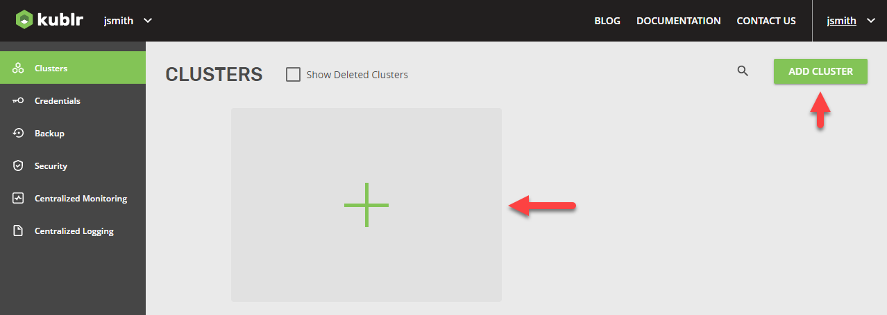
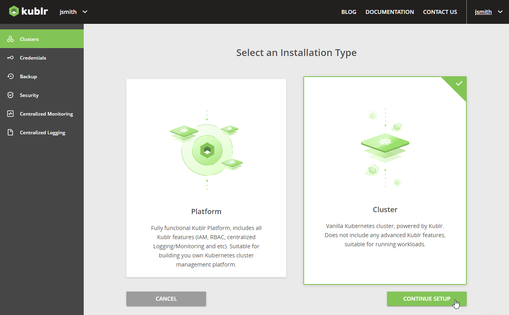
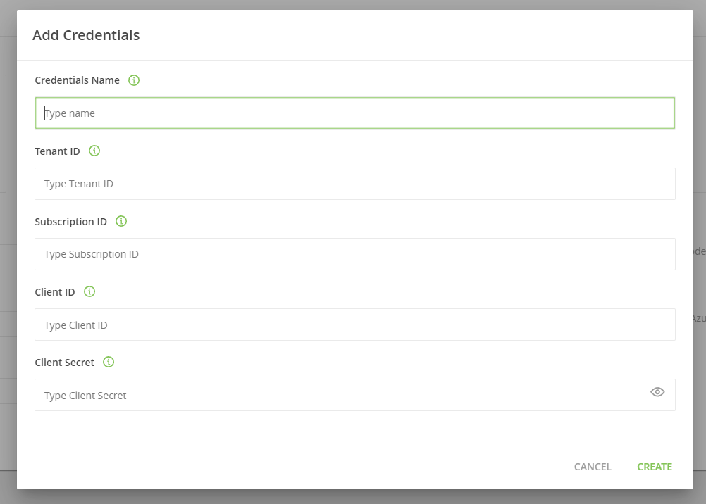
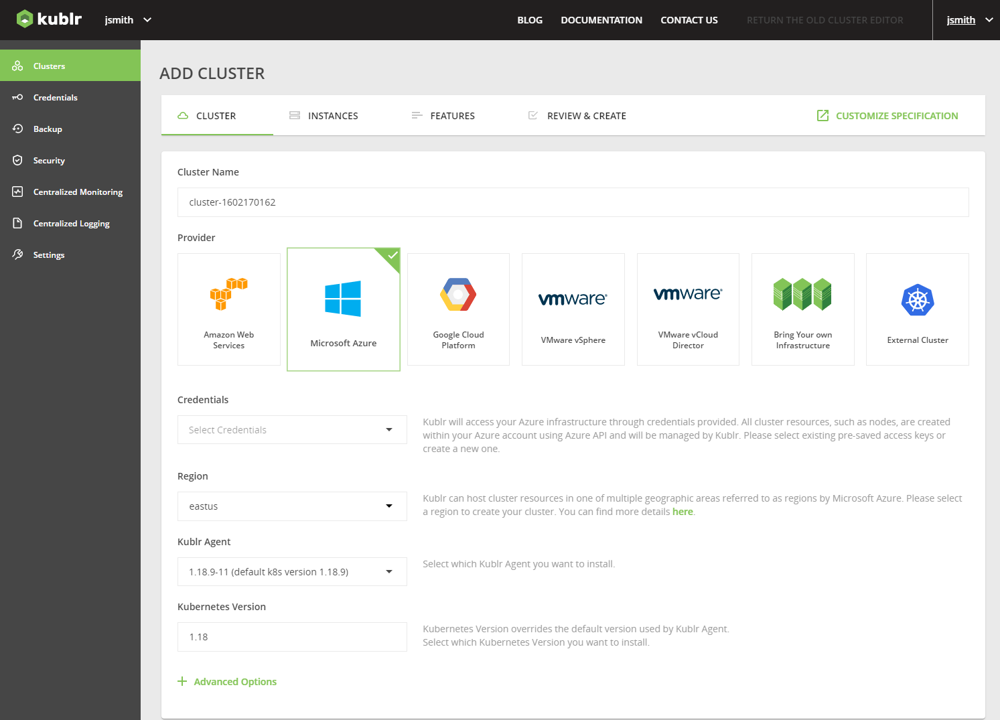
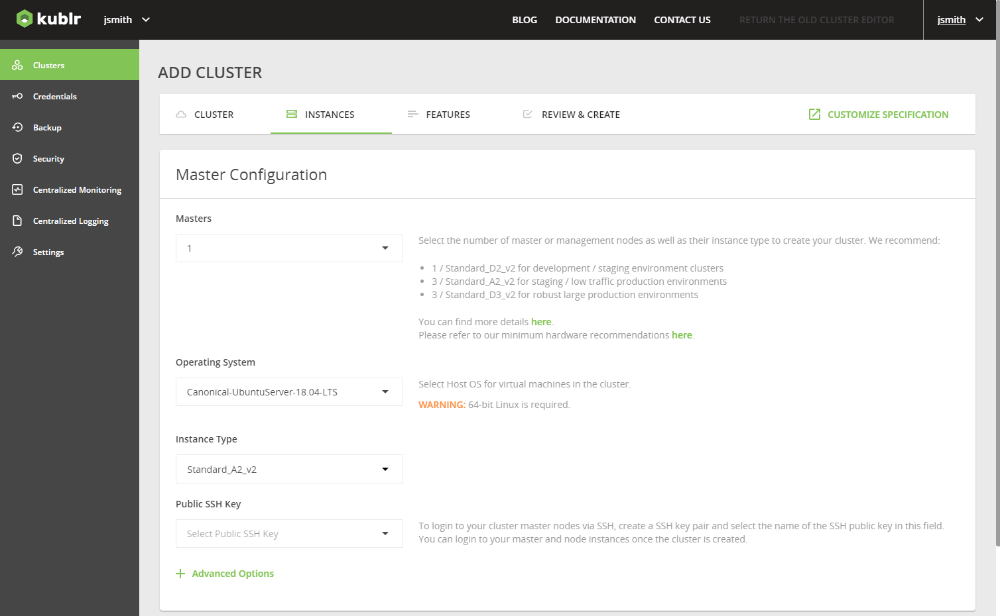
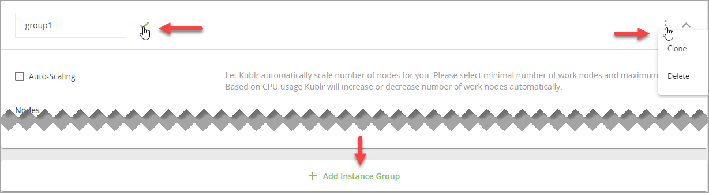
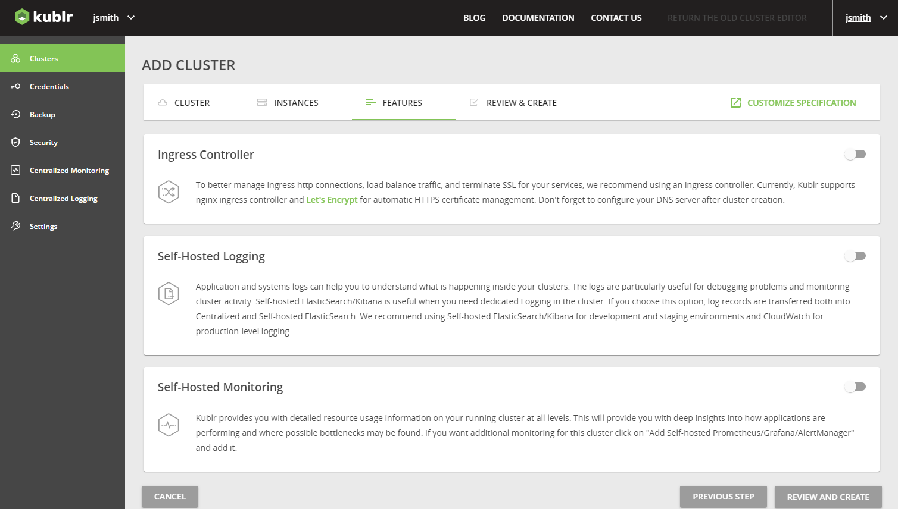
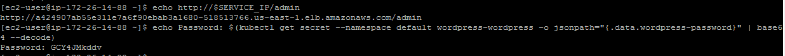

## Overview

Steps below describe how to use Kublr to create a Kubernetes cluster in Microsoft Azure infrastructure and deploy a simple application (WordPress) to that cluster. 

1. Prerequisites.
2. Installing the Kublr demo.
3. Creating Kubernetes cluster in Azure with Kublr.
4. Installing and configuring **kubectl**.
5. Deploying WordPress to a cluster using Helm.
   
### Prerequisites

1. Download and install [Docker](https://store.docker.com/search?offering=community&type=edition).*
2. 64-bit operating system to run the Kublr Demo/Installer.
3. 4GB RAM.
4. Your Azure account credentials.
   1. tenantId: ''
   2. subscriptionId: ''
   3. aadClientId: ''
   4. aadClientSecret: ''
5. A public SSH key.

>**Note** 

### Running Kublr

Open a terminal and launch following command:
``` bash
sudo docker run --name kublr -d --restart=unless-stopped -p 9080:9080 kublr/kublr:1.22.2
```

This should grab the Kublr image from Dockers image repository. This can take a moment depending on your internet speed. 

>**Note** Hereinafter, "sudo" is Linux specific - omit it to get command for Windows. We highly recommend you install docker on WSL 2 and run all the docker command from that linux environment. 

To make sure the image is downloaded and up and running with the following command.
``` bash
docker ps
```


## Creating Kubernetes Cluster in Azure with Kublr

Now to add a new cluster we simply login to the demo site at https://localhost:9080 with username: `admin` password: `kublrbox`. After logging in we navigate on the left hand menu to **Clusters**.Click **Add Cluster** or the big box with the plus sign.


For our purposed we just need a basic **Cluster** so select that and click **Continue Setup**. If you want to learn more about the different kinds of Installation types click [here](https://docs.kublr.com/installation/platform-vs-cluster/).


Since we are using Microsoft Azure select that **Provider**. Click on the dropdown from **Credentials** and select **Add New Credentials** and fill out the pop-out form with the appropriate information:
  * Credentials Name
  * Tenant ID
  * Subscription ID
  * Client ID
  * Client Secret
  
After you do so click **Create**. This can take a minute as your credentials are being verified by Kublr.



Give your **Cluster** a name and the rest of the form will be left on default. There are also some Advanced Options about which you can learn about [here](https://docs.kublr.com/installation/advanced_options/).



Now navigate to the **`INSTANCES`** tab at the top of the page to specify your kubernates clusters specifications. For our demo we will leave them all on default, but you need to create a new SSH key. If you don't have one already you can create one following this [article](https://docs.microsoft.com/en-us/azure/virtual-machines/linux/create-ssh-keys-detailed). There are also some Advanced Options about which you can learn about [here](https://docs.kublr.com/installation/advanced_options/).

      


> **Note** For your working nodes, you can have as many instance groups as you need (clone or delete the current instance group, or add another one). If necessary, give specific name to each group.    

Next navigate to the **`FEATURES`** tab to select and configure [FEATURES](https://docs.kublr.com/installation/features/) that you want to include into your cluster.

For the purposes of this demo we will be ignoring the **`FEATURES`** tab but you can learn more about them [here](https://docs.kublr.com/installation/features/)



We are almost done! Click the **`REVIEW & CREATE`** tab and review your cluster parameters. Once you are satisfied click **CONFIRM AND INSTALL**. A notification will be displayed "Your cluster is being created. It might take a few minutes."
You can watch your new cluster being created on the **Events**.

Your very first Kublr cluster is now up and running, now to deploy an actual application to it. 

## Application Deployment Example

Below is the example of how to deploy a simple WorldPress application into your cluster using Helm. But before we can install helm we need to install kubectl.

## kubectl

### Installing and Configuring kubectl

For detailed instructions, see the [Install and Set Up kubectl](https://kubernetes.io/docs/tasks/tools/install-kubectl/) article in Kubernetes documentation.

**For Mac users:**
``` bash
curl -LO https://storage.googleapis.com/kubernetes-release/release/$(curl -s https://storage.googleapis.com/kubernetes-release/release/stable.txt)/bin/darwin/amd64/kubectl
chmod +x ./kubectl
sudo mv ./kubectl /usr/local/bin/kubectl
```

**For Windows users:**

To download kubectl v.1.7.0, click [here](https://storage.googleapis.com/kubernetes-release/release/v1.7.0/bin/windows/amd64/kubectl.exe).Include the path with the kubectl executable to PATH environment variable.

  > For more information about adding tool locations to PATH variable, refer to [this article](https://msdn.microsoft.com/en-us/library/office/ee537574(v=office.14).aspx) in Microsoft documentation.

### Copying KubeConfig File

To retrieve the config from `Kublr` click on cluster in the cluster list to access the cluster details page. Then on the overview tab, download the config file.

IMAGE HERE

**For Mac users:**

``` bash
mkdir ~/.kube
cp ~/Downloads/config.yaml ~/.kube/config
```

**For Windows users:**

```
cd %HOME%
mkdir .kube
copy %HOME%\Downloads\config.yaml .kube\
```

Check that `kubectl` is working and is using the correct config file:

``` bash
kubectl config view
kubectl cluster-info
```

IMAGE HERE

### Installing Helm

Now that we have kubectl we need to install helm. [Click here for detailed guidelines](https://helm.sh/docs/intro/install/).

**For Mac users:**

``` bash
curl https://raw.githubusercontent.com/kubernetes/helm/master/scripts/get > get_helm.sh
chmod +x get_helm.sh
./get_helm.sh --version v
```

**For Windows users:**
Download helm **version v3.8.2 ** from [here](https://github.com/kubernetes/helm/releases). Then extract helm-vv3.8.2 -windows-amd64.zip to the directory where kubectl is saved. After that to initiate and test Helm installation do:
``` bash
helm init
```

### Installing WordPress

Finally we can instal WordPress with the following command:

```
helm install stable/wordpress --name wordpress
```

> NOTE: It may take a few minutes for the LoadBalancer IP to become available.

**For Mac users:**

``` bash
export SERVICE_IP=$(kubectl get svc --namespace default wordpress-wordpress -o jsonpath='{.status.loadBalancer.ingress[0].hostname}')
echo http://$SERVICE_IP/admin
echo Username: user
echo Password: $(kubectl get secret --namespace default wordpress-wordpress -o jsonpath='{.data.wordpress-password}' | base64 --decode)
```


Open the browser and navigate to the URL from console output.

**For Windows users:**

1. Run the following commands to get hostname and password:
``` bash
kubectl get svc --namespace default wordpress-wordpress -o jsonpath='{.status.loadBalancer.ingress[0].hostname}'
kubectl get secret --namespace default wordpress-wordpress -o jsonpath='{.data.wordpress-password}
```

1. Navigate to http://%hostname%/admin, where %hostname% is the hostname you got from the kubectl
1. Decode admin password with https://www.base64decode.org/ 

#### Congratulations! You have just deployed your first app in a Kubernetes cluster with Kublr!